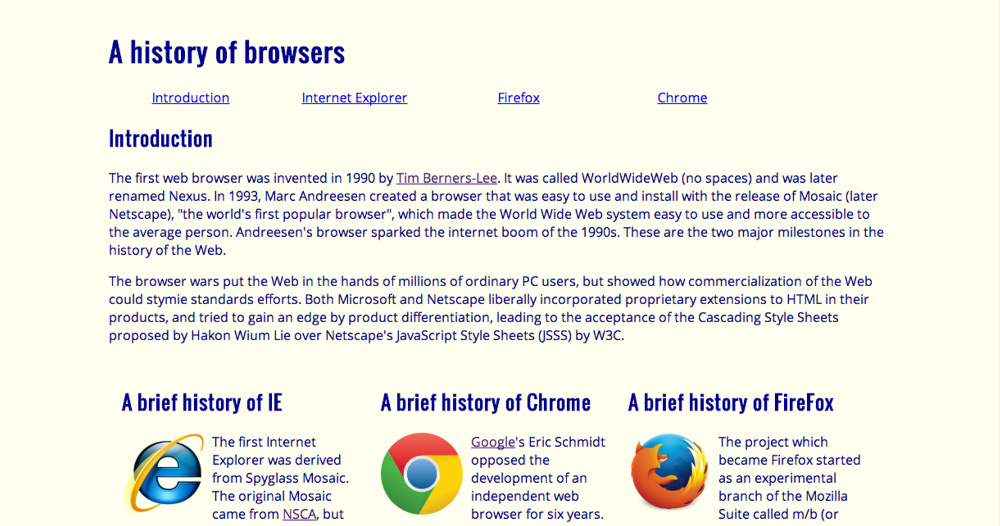
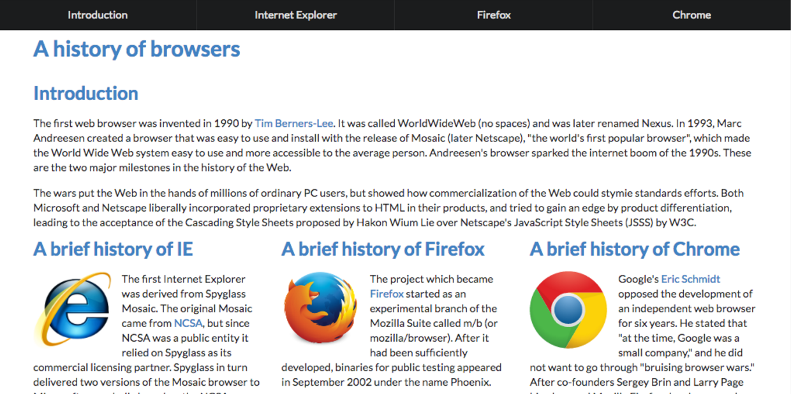

## Semantic UI

Enter <a href="http://semantic-ui.com/">Semantic UI</a>, making the HTML/CSS world a better place. Ever tried to make a website with raw HTML/CSS? Thought it was impossible? Well not to worry, with Semantic UI's easy to implement features web designing becomes an absolute breeze. Turn your website from this

into this!

Just look at that top navigation bar! 

## 10/10 Would Tell A Friend

Now with that being said, I like it! I've had experience with HTML/CSS prior to this class, and I've already enjoyed the language. Web designing is a nice break from the usual C/Java programming languages that we mostly do. Semantic UI manages to make the experience much greater in my opinion. Class names are closer to English rather than having random strings of words. This makes designing feel natural; saving a lot of time and stress. And in return, the end results of using the UI Framework are not disappointing.  
