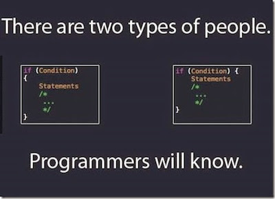

In my first engineering C programming class ever, we were only taught how to write code to make things work. There was no standard of how to write code. Everyones code looked different, which also made requesting for help from others pretty difficult. Whenever I look back at my old programs and try to decipher how the code works, upon first glance it hurts my eyes. My variables are random letters, white space is either everywhere or nowhere, and it's just line after line of inefficient code. I felt like I wasn't learning how the language worked, but rather I was just learning how to type in the language. 

## Coding Standards 

Later in my future ICS programming classes, coding standards were enforced. At first I thought the idea seemed like it was forced upon us, but after getting accustomed to it for a while it made understanding code much easier. It was then I realized there's much more to programming then just writing code that works. My ICS 211 professor would often reiterate to the class to "write and tell a story" in our code, or in other words make sure our variable names make sense.

Everyone has a different style or syntax when writing code. The end goal in writing code is to write it so our classmates and colleagues can understand it practically on the fly. This is easily accomplished when everyone is using similar code standards. This is especially important in collaboration projects. Eliminating all format inconsisties allows each group member to understand code much easier. 

After experiencing ESlint and Intellij, I don't have much problems working with it. Implementing this coding standard doesn't seem like a hassle after learning other coding standards before it. Initally I did have some problems with the style as I would still be used to other standards from previous classes. However, I though repeated use of ESLint and Intellij the style will just grow on me, and fewer errors will happen. 
