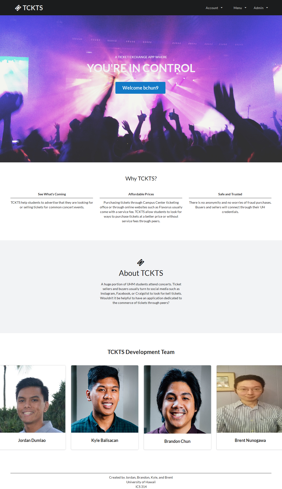

Manoa TCKTS is an appplication that allows University of Hawaii students to buy/sell concert tickets. This application also allow students to sell and buy tickets at a more affordable price, compared to buying tickets from outside ticket vendors at retail price.

This is was a group project that I collaborated with a three others to complete. During the period, I was mostly tasked with creating the landing page, shown in the image below, so new users are able to understand what the application will bring. Also, I finalized the layouts of the pages to ensure that the app looks good, and assisted the other group members in creating the functionality of the application.

I learned a lot about organizational management, and working as a team through this project. It was a great experience completing this application. 

For more information about the application visit the project page here: <a href="https://manoa-tckts.github.io/"><i class="large github icon"></i>Manoa TCKTS</a>

